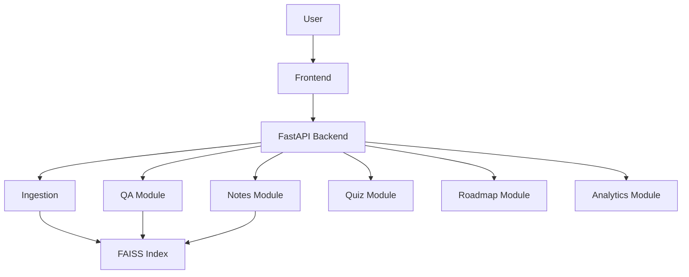
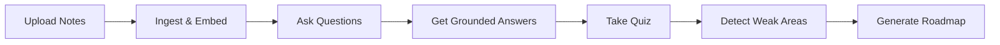
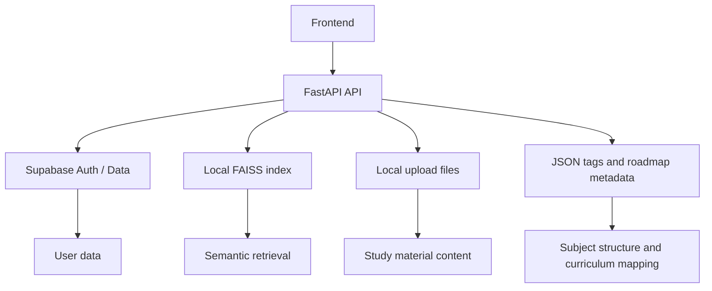

# RAG_v2 — 10 Slide Presentation

## Slide 1: Project Overview
RAG_v2 is an AI-powered study assistant that helps users learn from their own uploaded materials.

- Built with React frontend + FastAPI backend
- Uses AI to answer questions from user content
- Focused on personalized learning and revision

---

## Slide 2: Problem It Solves
Students often learn from scattered notes, PDFs, and study material, but struggle to:

- find relevant information quickly
- ask questions grounded in their own content
- get feedback on weak topics
- follow a guided study plan

RAG_v2 turns uploaded materials into a searchable learning system.

---

## Slide 3: Core Idea
The app follows a Retrieval-Augmented Generation approach.

This keeps answers grounded in the user’s uploaded notes and documents instead of generic responses.

---

## Slide 4: Technology Stack

### Frontend
- React
- Vite
- Tailwind CSS

### Backend
- Python
- FastAPI
- Pydantic

### AI & Search
- Cohere embeddings
- Cohere LLM
- FAISS vector database

### Data & Auth
- Supabase
- JSON subject metadata
- Local upload storage + indexes

---

## Slide 5: High-Level Architecture

The platform is structured as modular services, each tied to a learning workflow.

---

## Slide 6: Frontend Experience
The frontend is a study dashboard with screens for:

- login/signup
- upload
- notes
- Q&A
- quiz
- roadmap
- analytics
- study view

It creates one continuous learning journey from material upload to revision and planning.

---

## Slide 7: Backend Modules

### Key modules
- Ingestion: process uploaded files and create embeddings
- QA: answer questions using indexed content
- Notes: store, tag, and search personal notes
- Quiz: generate and evaluate assessments
- Roadmap: create personalized weekly study plans
- Analytics: track weak topics and learning trends

This modular separation keeps the system easier to scale and maintain.

---

## Slide 8: Core User Flow

This forms the project’s learning cycle: study → test → identify gaps → improve.

---

## Slide 9: Smart Learning Features
The app goes beyond chat by adding:

- note-based retrieval
- quiz generation from subject material
- weak-topic detection
- recommendation engine
- adaptive roadmap scheduling
- performance tracking over time

This makes it an intelligent learning companion rather than a simple chatbot.

---

## Slide 10: Current Status & Future Direction
Current state:

- functional modular structure
- AI-driven study features already in place
- active development and refactoring
- ongoing work for multi-user support and stronger data architecture

Future direction:

- better user-scoped data isolation
- more robust backend persistence
- richer analytics and dashboards
- broader subject and document support

RAG_v2 is a strong AI learning platform prototype aimed at personalized, content-grounded education.

---

## 10. Data and Storage Flow

### Storage and persistence layers
- Supabase handles auth and selected persistent records
- FAISS stores vectorized content for semantic retrieval
- Upload files act as the source material for learning content
- Tag JSON files define subject units and topics
- Quiz history supports weak-topic analysis and roadmap generation

---

## 11. End-to-End Learning Pipeline

This is the full loop of the application: upload material, retrieve answers, assess knowledge, identify weak areas, and generate a more focused study plan.

---

## 12. Summary

The project is best understood as a multi-module AI study platform with these core functions:

- Content ingestion and indexing
- Context-aware Q&A
- Personal notes and note search
- Quiz generation and evaluation
- Weak-topic detection
- Roadmap creation
- Analytics and learning insights

The architecture is modular enough to extend further with features such as:
- deeper multi-user isolation
- more robust database storage
- user-specific analytics dashboards
- richer subject management
- expanded note and book workflows

This project is essentially a retrieval-first learning assistant built for personalized study support.
